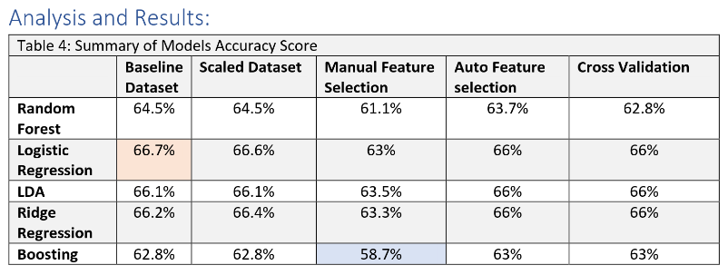

# :boxing_glove: Unveiling the Secrets of MMA: Predicting UFC Fight Winners using Machine Learning :martial_arts_uniform:
Comprehensive UFC fights analysis using machine learning models and stats technics. Contain a written report, code, and data  

## :card_file_box: Tech-stack 
- :broom: Data Cleaning: Numpy, Pandas, sklearn (LabelEncoder, SimpleImputer, train_test_split, StandardScaler), xgboost (XGBClassifier).
- :eyes: Data Visualization: mathplotlib.pyplot, seaborn, sklearn (plot_tree).
- :robot: Machine Learning Model: Random Forest, Logistic Regression, Linear Discriminant Analysis, Ridge Regression, Boosting. 
- :dart: Optimization: Standardization, Cross-validation, and Feature selections

## :bar_chart: Result: 
Able to predict a fight with a 66.7% accuracy score :tada: using logistic regression with only data engineering (see below for more info).

## :bookmark_tabs: Abstract
As the popularity of combat sports continues to rise, many casual viewers fail to grasp the intricacies of mixed martial arts (MMA). In the earlier days of the UFC, when fighters specialized in a single discipline like wrestling or boxing, predicting winners based on fighting style was relatively easier. However, in today's highly competitive landscape, successful fighters must possess a well-rounded understanding of all aspects of MMA, adding complexity to the sport. This paper aims to predict fight outcomes by leveraging historical fight data, fighter records, and physical attributes. Throughout the study, we explore the impact of physical attributes and identify the most effective machine learning model for prediction. Our approach involves feature engineering on the provided dataset, followed by a comparison of models such as logistic regression (LR), linear discriminant analysis (LDA), ridge regression, and boosting, using random forest as a baseline. Furthermore, we employ optimization techniques like standardization, cross-validation, and feature selection to improve accuracy. Surprisingly, logistic regression achieves a 66.7% accuracy score with data engineering alone. Additionally, based on the dataset, we observe a positive correlation between fight winners and advantages in reach/age. This finding suggests a cyclical nature in combat sports, where skill prevails over physical attributes, except when both fighters possess equal skills, in which case physical attributes play a more significant role. In essence, one can overcome a larger opponent with superior skills, but not when the larger opponent possesses equivalent skills.
